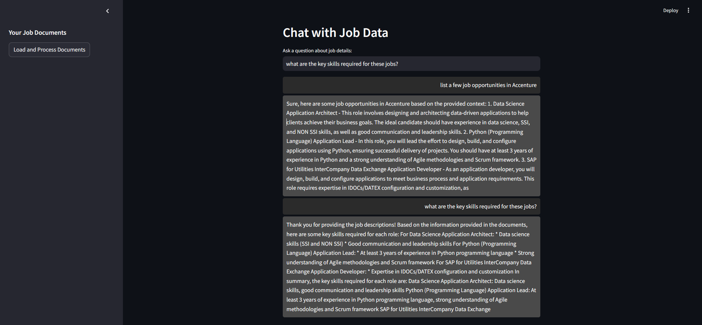

# Job Data Conversational Chatbot
A conversational bot built using LangChain and LLM using a jobs dataset that I extracted from careers pages.

This project is a **Retrieval-Augmented Generation (RAG)** based chatbot that I have worked on during my internship at Develup. It enables natural‑language queries over a large set of job listings, providing accurate, context‑aware answers using a **local LLaMA 2** model.

## Project Overview
- **Data Source:** 6,000+ job listings gathered via custom web scraping scripts (BeautifulSoup, Python) from multiple career pages.
- **Goal:** Allow job seekers or analysts to query detailed role, company, and skills information interactively, without exposing data to external APIs.
- **Approach:**  
  1. **Data preprocessing** — cleaned, validated, and standardised job listing CSVs.  
  2. **Embedding generation** — HuggingFace `all-MiniLM-L6-v2`.  
  3. **Semantic search** — FAISS vector database for fast retrieval.  
  4. **Local LLM inference** — LLaMA‑2‑7B‑Chat via LlamaCpp.  
  5. **Conversation orchestration** — LangChain `ConversationalRetrievalChain` with memory.  
  6. **User interface** — Streamlit‑based chat with custom styling.

 ## Key Features
- **Fully local** chatbot workflow (offline capability, privacy‑friendly)
- **Schema validation** for incoming CSV data (`title`, `company`, `job_description`, `key_skills`)
- **Prompt engineering** to ensure grounded, factual, and helpful responses
- **Multi‑turn conversation memory** for context retention
- **Polished UI** with styled chat bubbles for user/bot messages

## Tech Stack
- **Python**, **Pandas**
- **BeautifulSoup** (data scraping – pre‑internship work, dataset not included)
- **HuggingFace sentence-transformers** (`all-MiniLM-L6-v2`)
- **FAISS** (vector DB)
- **LangChain**
- **LlamaCpp** (local LLaMA 2 model inference)
- **Streamlit** (UI)

## Demo

